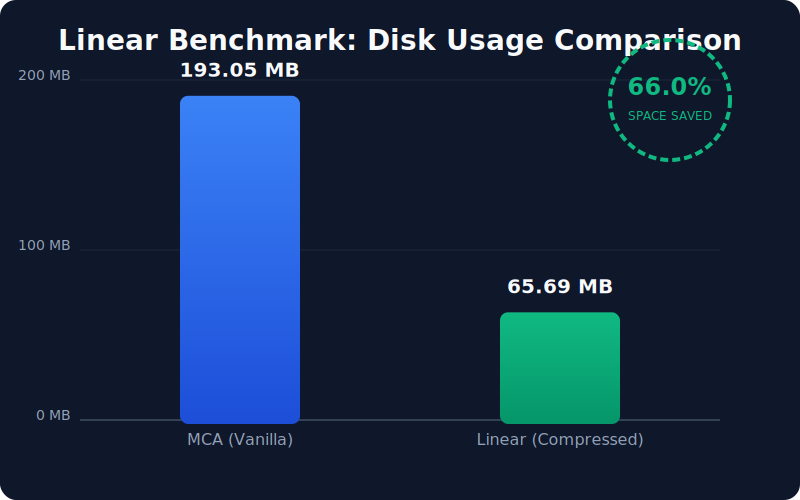

   

# Linear

**Linear** is a high-performance NeoForge 1.21.1 mod that replaces Minecraft's standard Anvil (`.mca`) region file format with the compressed [`.linear` format](https://github.com/xymb-endcrystalme/LinearRegionFileFormatTools), delivering dramatic reductions in world save size and save latency.

> **Tested benchmark results** on real-world region data:
> - 🗜️ **70–80% smaller** world saves (Zstd compression vs. Anvil's zlib)
> - ⚡ **~160x faster** chunk saves (asynchronous background flushes)
> - 📖 **Comparable or faster** chunk reads, especially under load

---

## Table of Contents

- [Features](#features)
- [Installation](#installation)
- [How It Works](#how-it-works)
- [Automatic World Conversion](#automatic-world-conversion)
- [Configuration](#configuration)
- [Compatibility](#compatibility)
- [Performance Benchmarks](#performance-benchmarks)
- [Commands](#commands)
- [Building from Source](#building-from-source)
- [Contributing](#contributing)
- [License](#license)

---

## Features

- **Automatic MCA → Linear conversion** — loads any existing world and converts it on first startup, no manual steps needed.
- **Bundled Zstd library** — ships with `zstd-jni` embedded in the JAR; no separate install required.
- **Asynchronous background saves** — chunk writes complete in microseconds on the server thread; compression happens on a background thread.
- **Lazy region loading** — region files are never read from disk inside the global storage lock, eliminating chunk-load stalls.
- **Per-region locking** — a `ReentrantReadWriteLock` per region allows concurrent reads across different regions.
- **Memory budget management** — LRU resident-data cache with configurable heap limits prevents excessive RAM usage on large servers.
- **Backup support** — automatic `.bak` rotation keeps a previous copy of each region on disk.
- **Idle recompression** — when the server is quiet, lightly-populated regions are recompressed to reclaim disk space.
- **Chunk pruning command** — `/linear prune-chunks` safely removes never-visited chunks (empty, InhabitedTime=0) to further shrink saves.
- **C2ME compatible** — intercepts C2ME's direct `RegionFile` write/clear paths via targeted Mixins.

---

## Installation

1. Download the latest `linear-X.Y.Z.jar` from [Releases](https://github.com/memesgmm/Linear/releases).
2. Place it in your NeoForge `mods/` folder.
3. Start your server or client. **That's it.**

On first launch, Linear will automatically convert any existing `.mca` world data to `.linear` format before the world loads. The original `.mca` files are deleted after a successful conversion.

> [!WARNING]
> **Back up your world before installing for the first time.** The conversion is irreversible without a backup.
> Linear will refuse to delete `.mca` files if the conversion fails, allowing you to retry safely.

---

## How It Works

### The `.linear` Format

The `.linear` format stores all 1024 chunks of a region in a single contiguous file, compressed as a whole with **Zstd**. Compared to the vanilla Anvil format:

| Property | Anvil (`.mca`) | Linear (`.linear`) |
| :--- | :--- | :--- |
| Compression | Per-chunk zlib | Whole-region Zstd |
| Random-access | Sector table | Load-on-demand |
| Typical size | 1.0 MB | 0.2–0.3 MB |

### Storage Architecture

```
RegionFileStorage
  └── RegionFileStorageMixin         ← replaces all read/write/flush/close
        ├── linearCache              ← LRU map: region coord → LinearRegionFile
        └── regionCache              ← LRU map: region coord → LinearBackedRegionFile
              └── LinearBackedRegionFile  ← RegionFile subclass (vanilla & C2ME compat)
                    └── LinearRegionFile       ← core: loading, writing, flushing
                          └── ZstdSupport      ← isolated classloader for zstd-jni
```

### Write Path
1. Vanilla/C2ME calls `write(ChunkPos, CompoundTag)` or `write(ChunkPos, ByteBuffer)`.
2. `RegionFileStorageMixin` / `RegionFileMixin` intercepts and routes to `LinearRegionFile.write()`.
3. Raw (uncompressed) NBT bytes are stored in memory — region is marked `dirty`.
4. After a configurable quiet period (`QUIET_FLUSH_DELAY_NS`), `LinearRuntime` submits the region to a background executor.
5. The executor compresses the entire region with Zstd and atomically renames a `.wip` file to the final `.linear` path.

### Read Path
1. A call to `read(ChunkPos)` reaches `RegionFileStorageMixin`.
2. `linearGetOrCreate()` returns a `LinearRegionFile` shell from the LRU cache (or creates one — no disk I/O yet).
3. `LinearRegionFile.read()` triggers `loadIfNeeded()` under a per-region write-lock on first access.
4. Subsequent reads use a per-region read-lock, allowing full concurrency across the region.

---

## Automatic World Conversion

Linear converts `.mca` files automatically when a world dimension is first opened. This is triggered from inside the `RegionFileStorage` constructor — the only safe point to run conversion before any chunk I/O begins.

- Conversion uses up to **4 parallel threads** (configurable via CPU core count).
- Each `.mca` file is read with vanilla `RegionFile` (supporting all compression types, including external `.mcc` files), and the chunk data is written verbatim to a new `LinearRegionFile`.
- Idempotent: if a `.linear` file already exists for a given region, the corresponding `.mca` is simply deleted.
- Failed conversions leave the original `.mca` intact so the server can retry on the next restart.

---

## Configuration

Configuration is stored in `config/linear.toml` (auto-generated on first run):

```toml
[storage]
# Zstd compression level (1–22). Default: 6. Higher = smaller files but more CPU.
compressionLevel = 6

# Whether to write in dsync mode (safer but slower on HDDs).
syncWrites = false

[backup]
# Enable automatic .bak backup rotation.
enabled = true

# How many minutes between backup refreshes.
intervalMinutes = 30

[pruning]
# Time (seconds) the prune-chunks confirmation window stays open.
confirmWindowSeconds = 30
```

---

## Compatibility

| Mod | Status | Notes |
| :--- | :---: | :--- |
| **C2ME** | ✅ | Full async write/clear path intercepted via `RegionFileMixin` |
| **Distant Horizons** | ✅ | DH pregen monitor pauses eviction during heavy pregen |
| **Sable / Sublevels** | ✅ | Each sub-level gets its own `RegionFileStorage` → automatic Linear conversion |
| **Create** | ✅ | No special handling needed |

Linear does **not** alter the NBT data inside chunks — it only changes how chunks are stored on disk. Any mod that reads vanilla NBT will work without modification.

### C2ME Integration Detail

C2ME bypasses `getChunkDataOutputStream` and calls `RegionFile.write(ChunkPos, ByteBuffer)` directly (via its `IRegionFile.invokeWriteChunk` accessor mixin). `RegionFileMixin` in Linear intercepts this call on `LinearBackedRegionFile` instances, strips the 5-byte MC chunk header, decompresses the payload, and writes raw NBT to `LinearRegionFile` — matching the vanilla write path exactly.

---

## Performance Benchmarks



### Test Environment
- **Seed**: `9131502383106133584`
- **Settings**: Default world generation
- **Instance**: NeoForge 1.21.1 with standard performance mods

### Comparison Summary

| Region | MCA Size | Linear Size | Savings | MCA Save | Linear Save | Speedup |
| :--- | :--- | :--- | :--- | :--- | :--- | :--- |
| r.0.0 | 940 KB | 189 KB | **80%** | 4,644 ms | 33 ms | **141x** |
| r.-1.-1 | 1,088 KB | 264 KB | **76%** | 4,084 ms | 21 ms | **195x** |
| r.0.-1 | 836 KB | 152 KB | **82%** | 3,281 ms | 12 ms | **273x** |
| r.-1.0 | 1,236 KB | 359 KB | **71%** | 4,409 ms | 34 ms | **130x** |

---

> [!NOTE]
> **Overall Benchmarks:** In a full world pregeneration test, Linear reduced the total world save size from **193 MB** to **66 MB** (**66% total saving**), including all entities and metadata.

---

## Commands

All commands require operator permission level 4.

### `/linear stats`
Displays live I/O statistics: cache hit/miss rates, chunk read/write counts and percentile latencies, flush counts, and current resident memory usage.

### `/linear prune-chunks`
Performs a **dry-run** analysis that identifies chunks safe to delete (never visited by players, `InhabitedTime = 0`, no entities, no block entities, no structure references). Prints a summary to chat.

```
/linear prune-chunks          # dry run
/linear prune-chunks confirm  # apply after reviewing the report
```

> [!CAUTION]
> `prune-chunks confirm` permanently deletes matching chunks from `.linear` region files. Run it while the server is quiet and keep backups.

### `/linear sync-backups`
Forces an immediate backup refresh of all loaded regions, updating `.bak` files to match the current state of the world.

---

## Building from Source

**Requirements:** JDK 21, Gradle 8.8+

```bash
git clone https://github.com/memesgmm/Linear.git
cd Linear

# Build the mod JAR (output: build/libs/linear-*.jar)
./gradlew build

# Run unit tests
./gradlew test

# Run the A/B performance benchmark (requires .mca corpus files)
./gradlew generateCorpus
./gradlew benchmark
```

### Project Structure

```
src/
├── main/java/com/memesgmm/linear/
│   ├── Linear.java          # Mod entry point
│   ├── LinearRuntime.java         # Background flush executor, stats, lifecycle
│   ├── LinearStats.java           # Thread-safe I/O telemetry
│   ├── command/                   # In-game commands (stats, prune-chunks, sync-backups)
│   ├── config/                    # LinearConfig (TOML-backed config)
│   ├── linear/                    # Core storage layer
│   │   ├── LinearRegionFile.java       # Region file implementation (load/read/write/flush)
│   │   ├── LinearBackedRegionFile.java # RegionFile subclass for vanilla & C2ME compat
│   │   ├── ZstdSupport.java            # Isolated classloader for zstd-jni
│   │   ├── MCAConverter.java           # Automatic .mca → .linear conversion
│   │   ├── LinearExporter.java         # .linear → .mca export (for reverting)
│   │   ├── IdleRecompressor.java       # Background idle recompression
│   │   └── DHPregenMonitor.java        # Distant Horizons pregen detection
│   └── mixin/
│       ├── RegionFileStorageMixin.java # Overwrites all chunk storage entry points
│       └── RegionFileMixin.java        # Intercepts C2ME's direct RegionFile paths
└── test/java/com/memesgmm/linear/
    ├── benchmark/LinearBenchmark.java  # A/B performance benchmark tool
    └── linear/                         # Unit & integration tests
```

---

## Contributing

Pull requests are welcome! Please:

1. **Open an issue first** for anything beyond small bug fixes, so we can discuss approach.
2. Match the existing code style (no Lombok, explicit field initialization, thorough Javadoc on public APIs).
3. All new storage logic **must** be covered by unit tests under `src/test/`.
4. Ensure `./gradlew test` passes before submitting.

---

## License

Linear is released under the **MIT License**. See [LICENSE](LICENSE) for the full text.

The bundled [zstd-jni](https://github.com/luben/zstd-jni) library is released under the BSD 2-Clause License.
The `.linear` file format was designed by [xymb-endcrystalme](https://github.com/xymb-endcrystalme/LinearRegionFileFormatTools).

---

### Credits
- Based on the original [LinearReader](https://github.com/Bugfunbug/LinearReader) mod by **Bugfunbug**.
