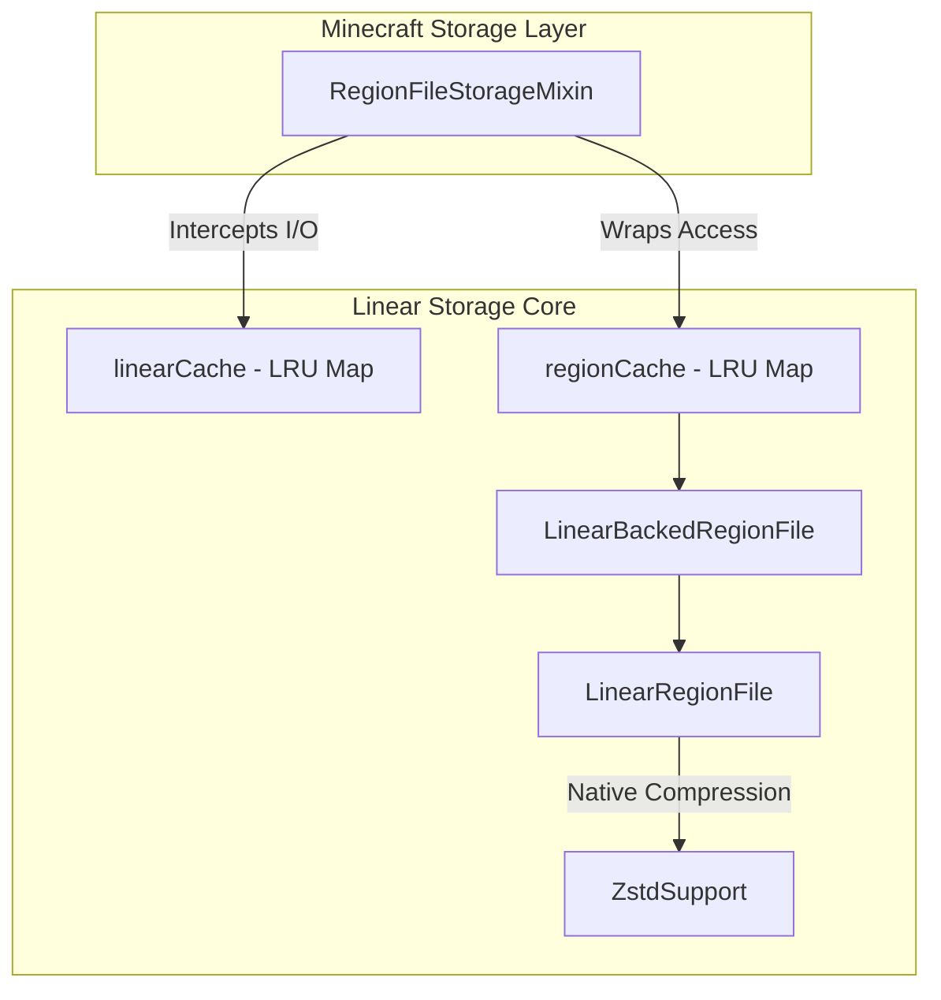

# Linear Documentation

This document contains detailed information on installation, configuration, and the technical architecture of the Linear mod.

## Table of Contents

- [Installation](#installation)
- [How It Works](#how-it-works)
- [Automatic World Conversion](#automatic-world-conversion)
    - [Reverting to Anvil](#reverting-to-anvil-mca)
- [Configuration](#configuration)
- [Compatibility](#compatibility)
- [Commands](#commands)
- [Idle Recompression](#idle-recompression)
- [Benchmarking & Telemetry](#benchmarking--telemetry)
- [Building from Source](#building-from-source)
- [License](#license)

---

## Installation

1. Download the correct JAR for your NeoForge version from [Releases](https://github.com/memesgmm/Linear/releases):
    *   **1.21.1 – 1.21.11**: Use `Linear-1.21.x-1.1.0.jar` (**Requires Java 21**).
    *   **26.1.x+**: Use `Linear-26.x-1.1.0.jar` (**Requires Java 25**).
2. Place the JAR in your NeoForge `mods/` folder.
3. Ensure your Java runtime matches the requirement (Java 25 for NeoForge 26+).
4. Start your server or client.

On first launch, Linear will automatically convert any existing `.mca` world data to `.linear` format before the world loads. The original `.mca` files are deleted after a successful conversion.

> [!WARNING]
> **Back up your world before installing for the first time.** While Linear now supports [converting back to Anvil](#format-reversion) via command, a full backup is still strongly recommended.
> Linear will refuse to delete `.mca` files if the initial conversion fails, allowing you to retry safely.

---

## How It Works

### The `.linear` Format
The `.linear` format stores all 1024 chunks of a region in a single contiguous file, compressed as a whole with **Zstandard**. Unlike the vanilla Anvil format (`.mca`), which compresses each chunk individually, Linear compresses the entire region. This allows the compression algorithm to exploit data redundancies across different chunks, leading to significantly smaller file sizes.

### Storage Architecture


### Technical Highlights
- **Threaded I/O**: All compression and disk writes are handled by a dedicated background executor to prevent server thread stalls.
- **Zstd Isolation**: Uses an isolated classloader for `zstd-jni` to avoid version conflicts with other mods.
- **Concurrent Access**: Uses per-region read/write locks, allowing multiple threads to read chunks from the same region simultaneously while ensuring write safety.
- **Checksum Verification**: Every `.linear` file includes a CRC32 checksum for the entire compressed block, validated on every load.

### Read/Write Lifecycle
1. **Read Path**: `RegionFileStorageMixin` checks `linearCache`. If not present, `LinearRegionFile` loads and decompresses the entire region into memory.
2. **Write Path**: Chunks are written to a memory buffer. When the region becomes "dirty," it is scheduled for a background flush.
3. **Background Flush**: The executor compresses the memory buffer using Zstandard and performs an atomic rename (`.wip` -> `.linear`) to ensure data integrity even during crashes.

---

## Automatic World Conversion

Linear converts `.mca` files automatically when a world dimension is first opened. 
- Each `.mca` file is read with vanilla `RegionFile` and written verbatim to a new `LinearRegionFile`.
- Idempotent: if a `.linear` file already exists, the corresponding `.mca` is deleted.
- Failed conversions leave the original `.mca` intact.

### Reverting to Anvil (`.mca`)
If you wish to uninstall the mod and return to the standard Minecraft format, you can use the `/linear revert-to-mca` command. This will:
1. Scan all `.linear` files across all dimensions.
2. Convert them back to standard `.mca` files.
3. Shut down the server once complete.
See the [Commands](#format-reversion) section for more details.

---

## Configuration

Configuration is stored in `config/linear-server.toml`.

### General Settings
- `compressionLevel` (1–22): Zstd compression level used for normal writes. Recommended: 4-6. Default: `4`.
- `regionCacheSize` (8–1024): Maximum number of region files kept in RAM. Default: `256`.
- `slowIoThresholdMs`: Logging threshold for slow disk operations. Set to `-1` to disable. Default: `500`.
- `diskSpaceWarnGb`: Warn if free disk space falls below this value. Set to `-1` to disable. Default: `1`.

### Backup Settings
- `backupEnabled`: Enable automatic `.linear.bak` rotation. Default: `true`.
- `backupMinChangedChunks`: Minimum chunk changes before a backup refresh. Default: `32`.
- `backupMinChangedKb`: Minimum changed payload (KB) before a backup refresh. Default: `2048`.
- `backupMaxAgeMinutes`: Maximum age of a changed backup before refresh. Default: `30`.
- `backupQuietSeconds`: Required region "quiet time" before a backup is allowed. Default: `60`.

### Save Throttling
- `regionsPerSaveTick` (1–64): Max regions flushed to background executor per tick during world save. Default: `4`.
- `pressureFlushMinDirtyRegions` / `pressureFlushMaxDirtyRegions`: Bounds for the dynamic backlog flusher. Default: `4` / `16`.
- `confirmWindowSeconds`: Confirmation window for destructive commands. Default: `60`.

### Idle Recompression
- `autoRecompressEnabled`: Enable background upgrading of files to level 22 during idle time. Default: `true`.
- `idleThresholdMinutes`: Minutes of zero I/O activity required to start recompression. Default: `20`.
- `recompressMinFreeRamPercent`: Safety threshold for JVM heap headroom during recompression. Default: `15`.

### Benchmarking
- `pregenExportEnabled`: Automatically export JSON stats on server shutdown. Default: `false`.

---

## Compatibility

| Mod | Status | Notes |
| :--- | :---: | :--- |
| **NeoForge 1.21.x** | ✅ | Stable lifecycle (Java 21) |
| **NeoForge 26.x+** | ✅ | Modern lifecycle (Java 25) |
| **C2ME** | ✅ | Full async write/clear path intercepted for maximum compatibility |
| **Distant Horizons** | ✅ | Pregen monitor automatically pauses cache eviction during heavy world pregeneration |
| **Sable / Sublevels** | ✅ | Automatic conversion and storage support for each sub-level dimension |
| **Chunky** | ✅ | Recommended for pregenerating worlds to fill Linear cache efficiently |

Linear does **not** alter the NBT data inside chunks. Any mod that reads vanilla NBT will work without modification.

---

## Commands

Requires operator permission level 2 or higher (configurable via NeoForge permission API).

### Diagnostic & Info
- `/linear pos`: Displays block, chunk, and region coordinates for your current position.
- `/linear cache_info`: Shows live RAM usage, dirty regions, and open file counts.
- `/linear storage`: Scans the world folder to display total disk usage of `.linear` and `.linear.bak` files.
- `/linear verify`: Starts a background thread to verify the integrity and checksums of every `.linear` file on disk.
- `/linear bench [debug | reset]`: Displays real-time I/O statistics, phase timings, and compression ratios. Use `debug` for internal phase latency.

### Utility & Maintenance
- `/linear sync-backups`: Forces an immediate backup refresh for all modified regions.
- `/linear prune-chunks`: Analyzes the world for never-visited or empty chunks that can be safely deleted.
- `/linear prune-chunks confirm`: Permanently deletes analyzed chunks.
- `/linear pin` / `/linear unpin`: Prevents or allows a specific region from being evicted from the RAM cache.

### Background Operations
- `/linear afk-compress [status | start | stop]`: Manages the background recompression worker which upgrades old files to level 22 compression during idle time.
- `/linear export-mca [status | start | stop]`: Copies the current Linear world back to Anvil (`.mca`) format in a separate folder (`<world>_mca_export/`). The active world is not modified.
- `/linear export-stats`: Manually triggers a JSON benchmark export (requires `pregenExportEnabled` to be true).

### Format Reversion
- `/linear revert-to-mca`: Prepares the server to convert the entire world back to `.mca` format.
- `/linear revert-to-mca confirm`: **Destructive**. Converts all files back to `.mca` and immediately shuts down the server. The mod must be removed manually before restarting.

## Idle Recompression

Linear includes an intelligent background worker designed to maximize storage efficiency during server idle time.

### How it Works
1. **Activity Monitor**: The mod tracks the time since the last chunk read or write across all dimensions.
2. **Idle Trigger**: Once the server has been idle for `idleThresholdMinutes`, the recompression worker starts.
3. **Deep Compression**: The worker scans all `.linear` files and upgrades them to **Zstd level 22**. Normal gameplay writes use level 4-6 to save CPU time; idle time is used to shrink files further without affecting TPS.
4. **Safety Checks**: The worker automatically pauses if the server becomes active again or if available RAM falls below `recompressMinFreeRamPercent`.

---

## Benchmarking & Telemetry

Linear is designed with transparency in mind, providing granular telemetry for performance analysis.

### Real-time Stats
Use `/linear bench` to see current I/O performance. 
- **Saved**: Total percentage of disk space saved compared to raw NBT data.
- **Phases**: Phase timings (zstd, disk, crc) help identify hardware bottlenecks.

### Automated Export
For formal benchmarking (e.g., using **Chunky**), enable `pregenExportEnabled` in the config.
- A comprehensive JSON report is generated in the world folder on server shutdown.
- The report includes chunk read/write averages, cache hit rates, and total disk footprint.
- Ideal for comparing Linear against vanilla MCA performance on identical hardware.

---

## Building from Source

**Requirements:** JDK 21 (for Legacy) or JDK 25 (for Modern), Gradle 8.10+

```bash
git clone https://github.com/memesgmm/Linear.git
cd Linear

# Build for Legacy (1.21.x / Java 21)
./gradlew jar -PbuildTarget=legacy

# Build for Modern (26.x / Java 25)
./gradlew jar -PbuildTarget=modern

# Build both and copy to build/libs/
./scripts/build_all.sh
```

---

## License

Linear is released under the **MIT License**.
The bundled [zstd-jni](https://github.com/luben/zstd-jni) library is released under the BSD 2-Clause License.
The `.linear` file format was designed by [xymb-endcrystalme](https://github.com/xymb-endcrystalme/LinearRegionFileFormatTools).
